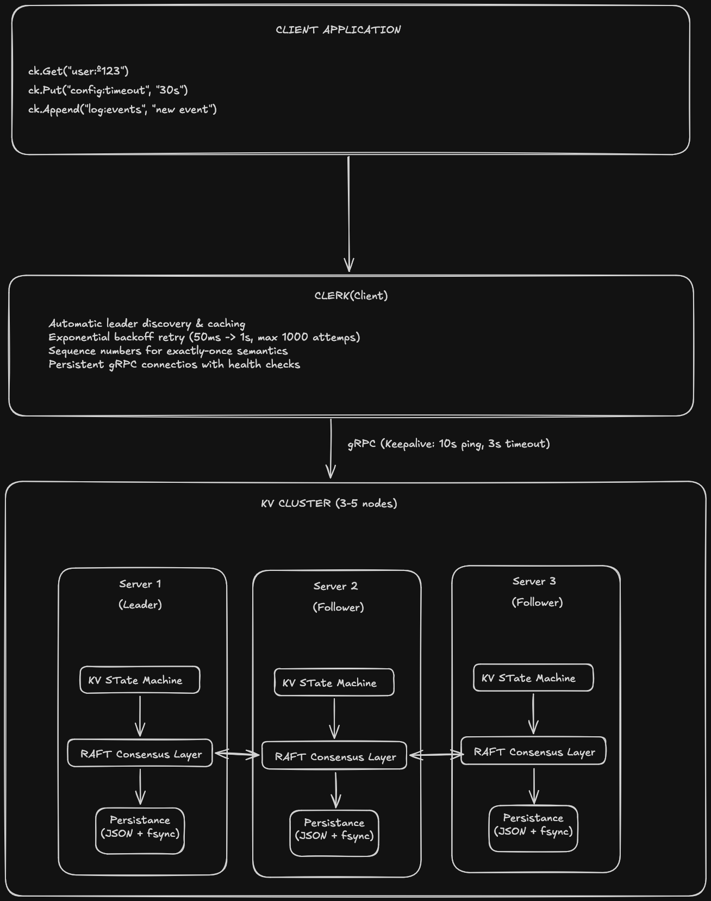

# distribKV

> **Production-grade Distributed Key-Value Store implementing the Raft consensus algorithm in Go**

[](https://golang.org/)
[](https://grpc.io/)
[](LICENSE)

**~2,500 LOC | Full Raft Implementation | Fault-Tolerant | Linearizable**

---

## What is distribKV?

distribKV is a distributed key-value store that demonstrates how production systems like **etcd**, **Consul**, and **TiKV** achieve fault tolerance and strong consistency. Built from scratch in Go, it implements the [Raft consensus algorithm](https://raft.github.io/) to ensure all nodes in a cluster agree on every operation—even during network partitions and node failures.

### The Problem It Solves

In distributed systems, making multiple servers agree on state is notoriously difficult. Network delays, crashes, and partitions can cause replicas to diverge. distribKV solves this through:

- **Consensus**: Raft ensures all nodes agree on the order of operations
- **Fault Tolerance**: Automatic leader election when nodes fail
- **Strong Consistency**: Linearizable reads and writes (as if there's only one copy of the data)
- **Crash Recovery**: Persistent state survives restarts

---

## Architecture



### Two-Layer Design

**1. Raft Consensus Layer** (`pkg/raft/`)

- Leader election with randomized timeouts (150-300ms)
- Log replication with conflict detection
- State persistence (atomic writes with fsync)
- Apply channel for state machine integration

**2. Key-Value Service Layer** (`pkg/kvserver/`)

- Get/Put/Append operations through Raft
- Duplicate detection (100-entry cache per client, 10s TTL)
- Thread-safe concurrent operations
- Leader tracking and hints for clients

---

## Technical Highlights

### Challenges Solved

| Challenge                  | Solution                                                                          |
| -------------------------- | --------------------------------------------------------------------------------- |
| **Leader Election**        | Randomized timeouts prevent split votes; exponential backoff for failed elections |
| **Log Consistency**        | `nextIndex`/`matchIndex` tracking with automatic retry on mismatch                |
| **Network Partitions**     | Leader steps down when partitioned; new leader elected on majority side           |
| **Crash Recovery**         | Persistent state (term, votedFor, log) restored atomically on startup             |
| **Exactly-Once Semantics** | Client sequence numbers with server-side deduplication cache                      |
| **Client Failover**        | Automatic leader discovery with 1000-attempt retry and exponential backoff        |

### Key Design Decisions

**Why Raft over Paxos?**
Raft prioritizes understandability without sacrificing correctness. Its "separability" (leader election, log replication, safety as independent components) makes it ideal for learning and production implementations.

**Why gRPC?**
Type-safe Protocol Buffers with built-in features: HTTP/2 multiplexing, flow control, and keepalive health checks. Critical for detecting failed nodes quickly.

**Why Strong Consistency (Linearizability)?**
Every operation appears to execute instantaneously at some point between invocation and response. Simpler application logic compared to eventual consistency—at the cost of availability during partitions.

### CAP Theorem Position

distribKV chooses **CP** (Consistency + Partition Tolerance):

- During network partitions, the system remains consistent
- Minority partitions become unavailable (no "split-brain")
- When partition heals, nodes automatically rejoin with consistent state

---

## Quality Assurance

### Testing Strategy

```bash
# Race condition detection
go test -race ./...

# Specific component tests
go test ./pkg/raft -run TestElection -v
go test ./pkg/kvserver -run TestConcurrent -v

# Coverage with race detection
go test -race -cover ./...
```

### Validated Behaviors

- ✅ Leader election within 300ms after failure
- ✅ Log replication to majority before commit
- ✅ Automatic recovery after node crash
- ✅ Linearizability under concurrent clients
- ✅ Duplicate request elimination
- ✅ 2+ minutes continuous cluster operation

---

## Quick Start

### Prerequisites

- Go 1.25.5+
- Protocol Buffers compiler (`protoc`)

### Build

```bash
git clone https://github.com/jonandonigv/distribKV.git
cd distribKV
go mod tidy
go build -o bin/ ./cmd/...
```

### Run a Cluster

```bash
# Start 3-node cluster (uses provided script)
./scripts/start-cluster.sh

# Or start manually
cd bin
./kvserver -id=1 -peers="localhost:10001,localhost:10002,localhost:10003" &
./kvserver -id=2 -peers="localhost:10001,localhost:10002,localhost:10003" &
./kvserver -id=3 -peers="localhost:10001,localhost:10002,localhost:10003" &
```

### Use the Client

```go
package main

import (
    "fmt"
    "github.com/jonandonigv/distribKV/pkg/kvserver"
)

func main() {
    // Connect to cluster
    ck := kvserver.MakeClerk([]string{
        "localhost:10001",
        "localhost:10002",
        "localhost:10003",
    }, false)

    // Operations automatically route to leader
    ck.Put("key", "value")
    value := ck.Get("key")
    ck.Append("key", "-suffix")

    fmt.Println(ck.Get("key")) // "value-suffix"
}
```

---

## Project Structure

```
distribKV/
├── cmd/
│   ├── kvserver/          # Main KV server binary
│   ├── kv-client/         # Interactive test client
│   ├── grpc-test-server/  # gRPC health check testing
│   └── grpc-test-client/  # gRPC health check testing
├── pkg/
│   ├── raft/              # Core Raft consensus (~1,200 LOC)
│   │   ├── raft.go        # Main struct and state machine
│   │   ├── election.go    # Leader election and timers
│   │   ├── replication.go # Log replication and heartbeats
│   │   └── persistance.go # State persistence
│   ├── kvserver/          # KV service layer (~800 LOC)
│   │   ├── server.go      # RPC handlers and apply loop
│   │   ├── clerk.go       # Client library
│   │   └── types.go       # Type definitions
│   └── common/            # gRPC utilities
├── proto/                 # Protocol Buffer definitions
│   ├── raft.proto         # Raft RPCs
│   ├── kv.proto           # KV service RPCs
│   └── health.proto       # Health check service
└── scripts/               # Cluster management scripts
```

---

## Tech Stack & Skills Demonstrated

### Languages & Frameworks

- **Go 1.25.5** — Concurrency primitives (goroutines, channels, mutexes, sync.Cond)
- **gRPC** — High-performance RPC framework with streaming support
- **Protocol Buffers** — Type-safe message serialization

### Distributed Systems Concepts

- **Consensus Algorithms** — Raft (leader election, log replication, safety)
- **Fault Tolerance** — Crash recovery, network partition handling
- **Consistency Models** — Linearizability, CAP theorem tradeoffs
- **State Machine Replication** — Deterministic execution of replicated logs

### System Design Patterns

- **Concurrent Programming** — Lock-free patterns where possible, careful mutex ordering
- **Error Handling** — Explicit error returns, no panics in normal operation
- **Resource Management** — Proper connection lifecycle, context cancellation
- **Persistence** — Atomic file operations, crash-safe state management

---

## Resources

- [Raft Paper](https://raft.github.io/raft.pdf) — The consensus algorithm foundation
- [MIT 6.824 Distributed Systems](https://pdos.csail.mit.edu/6.824/) — Course inspiration
- [Raft Visualization](https://raft.github.io/) — Interactive algorithm demo

---

## License

MIT

---

_Built as a learning project following MIT 6.824, architected with production patterns in mind._
